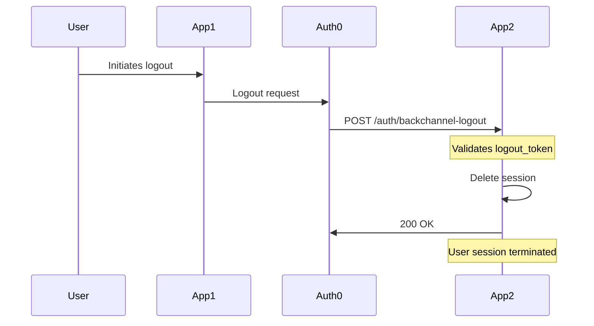

## Overview

Back-Channel Logout is an OpenID Connect feature that allows Auth0 to notify your application when a user's session is terminated. This enables you to invalidate the user's session in your application even when the logout is initiated from a different application or by an administrator.

<Info>
Read more about [Back-Channel Logout in the Auth0 documentation](https://auth0.com/docs/authenticate/login/logout/back-channel-logout).
</Info>

## How It Works

When a Back-Channel Logout event occurs:

1. Auth0 sends a `logout_token` (a JWT) to your application's `/auth/backchannel-logout` endpoint
2. The SDK validates the `logout_token` signature and claims
3. The SDK calls your session store's `deleteByLogoutToken` method
4. Your session store removes the user's session based on the `sid` or `sub` claim
5. Your application responds with 200 OK to acknowledge the logout



## Prerequisites

<Warning>
Back-Channel Logout requires a stateful session store implementation. Cookie-based sessions alone cannot support Back-Channel Logout because there's no way to invalidate cookies stored on the client without their participation.
</Warning>

You must implement a custom session store with the `deleteByLogoutToken` method. See the [Database Sessions](/advanced/database-sessions) guide for implementation details.

## Configuration

### Step 1: Implement Session Store

Create a session store with `deleteByLogoutToken` support:

```typescript lib/session-store.ts
import { SessionDataStore } from "@auth0/nextjs-auth0/server";
import type { SessionData, LogoutToken } from "@auth0/nextjs-auth0/types";

export class DatabaseSessionStore implements SessionDataStore {
  async get(sid: string): Promise<SessionData | null> {
    // Retrieve session from database
    const session = await db.sessions.findUnique({ where: { sid } });
    return session ? JSON.parse(session.data) : null;
  }

  async set(sid: string, session: SessionData): Promise<void> {
    // Store session in database
    await db.sessions.upsert({
      where: { sid },
      update: {
        data: JSON.stringify(session),
        updatedAt: new Date()
      },
      create: {
        sid,
        data: JSON.stringify(session),
        sub: session.user.sub,
        // Store session ID from tokenSet if available
        sessionId: session.tokenSet?.sessionId
      }
    });
  }

  async delete(sid: string): Promise<void> {
    // Delete session from database
    await db.sessions.delete({ where: { sid } });
  }

  async deleteByLogoutToken(logoutToken: LogoutToken): Promise<void> {
    // Handle Back-Channel Logout
    // LogoutToken contains either sid, sub, or both

    if (logoutToken.sid) {
      // Delete by session ID (most specific)
      await db.sessions.deleteMany({
        where: { sessionId: logoutToken.sid }
      });
    } else if (logoutToken.sub) {
      // Delete all sessions for this user
      await db.sessions.deleteMany({
        where: { sub: logoutToken.sub }
      });
    }
  }
}
```

<Note>
The `LogoutToken` object contains either a `sid` claim (session ID), a `sub` claim (user ID), or both. Your implementation should handle all cases appropriately.
</Note>

### Step 2: Configure Auth0Client

Configure your Auth0 client to use the session store:

```typescript lib/auth0.ts
import { Auth0Client } from "@auth0/nextjs-auth0/server";
import { DatabaseSessionStore } from "./session-store";

export const auth0 = new Auth0Client({
  sessionStore: new DatabaseSessionStore()
  // Other configuration...
});
```

### Step 3: Verify Route is Mounted

The SDK automatically mounts the `/auth/backchannel-logout` route. Verify it's accessible:

```bash
curl -X POST http://localhost:3000/auth/backchannel-logout
```

You should receive a 400 error (missing logout_token) instead of 404, confirming the route is mounted.

### Step 4: Configure Auth0 Dashboard

In your Auth0 Dashboard:

<Steps>
  <Step title="Enable Back-Channel Logout">
    Go to Applications > Your Application > Advanced Settings > OAuth

    Enable "Back-Channel Logout"
  </Step>

  <Step title="Configure Logout URL">
    Set the Back-Channel Logout URL to your application's endpoint:

    ```
    https://your-app.example.com/auth/backchannel-logout
    ```
  </Step>

  <Step title="Save Changes">
    Save your application settings.
  </Step>
</Steps>

## Custom Route Path

You can customize the Back-Channel Logout route path:

```typescript lib/auth0.ts
import { Auth0Client } from "@auth0/nextjs-auth0/server";

export const auth0 = new Auth0Client({
  routes: {
    login: "/login",
    logout: "/logout",
    callback: "/callback",
    backChannelLogout: "/backchannel-logout" // Custom path
  }
});
```

<Warning>
If you customize the route path, update the Back-Channel Logout URL in your Auth0 Dashboard to match.
</Warning>

## Session ID Handling

The `sid` (session ID) claim in the logout token refers to the Auth0 session ID, not your application's session ID. Store this mapping in your database:

```typescript
interface SessionRecord {
  sid: string; // Your application's session ID
  sub: string; // User's subject identifier
  sessionId?: string; // Auth0's session ID (from tokenSet)
  data: string; // Serialized session data
}
```

### Storing Auth0 Session ID

The Auth0 session ID is available in `tokenSet.sessionId` after callback:

```typescript
// In beforeSessionSaved hook or when storing session
const sessionData: SessionData = {
  user: { ... },
  tokenSet: {
    accessToken: "...",
    idToken: "...",
    sessionId: "auth0_session_id" // Store this for Back-Channel Logout
  }
};

await sessionStore.set(sid, sessionData);
```

## LogoutToken Structure

The `LogoutToken` object passed to `deleteByLogoutToken` has the following structure:

```typescript
interface LogoutToken {
  /** Session ID from Auth0 (if available) */
  sid?: string;

  /** User's subject identifier (if available) */
  sub?: string;

  /** Events claim (always contains backchannel-logout event) */
  events: {
    "http://schemas.openid.net/event/backchannel-logout": {};
  };

  /** Issuer (Auth0 domain) */
  iss: string;

  /** Audience (your client ID) */
  aud: string;

  /** Issued at timestamp */
  iat: number;

  /** JWT ID */
  jti: string;
}
```

## Implementation Examples

### Prisma Session Store

```typescript lib/session-store.ts
import { PrismaClient } from "@prisma/client";
import { SessionDataStore } from "@auth0/nextjs-auth0/server";
import type { SessionData, LogoutToken } from "@auth0/nextjs-auth0/types";

const prisma = new PrismaClient();

export class PrismaSessionStore implements SessionDataStore {
  async get(sid: string): Promise<SessionData | null> {
    const session = await prisma.session.findUnique({
      where: { sid }
    });

    if (!session) return null;

    // Check expiration
    if (session.expiresAt && session.expiresAt < new Date()) {
      await this.delete(sid);
      return null;
    }

    return JSON.parse(session.data);
  }

  async set(sid: string, session: SessionData): Promise<void> {
    const expiresAt = new Date(Date.now() + 7 * 24 * 60 * 60 * 1000); // 7 days

    await prisma.session.upsert({
      where: { sid },
      update: {
        data: JSON.stringify(session),
        expiresAt,
        updatedAt: new Date()
      },
      create: {
        sid,
        data: JSON.stringify(session),
        sub: session.user.sub,
        sessionId: session.tokenSet?.sessionId,
        expiresAt
      }
    });
  }

  async delete(sid: string): Promise<void> {
    await prisma.session.delete({ where: { sid } }).catch(() => {
      // Ignore if session doesn't exist
    });
  }

  async deleteByLogoutToken(logoutToken: LogoutToken): Promise<void> {
    console.log("Back-Channel Logout received:", {
      sid: logoutToken.sid,
      sub: logoutToken.sub
    });

    if (logoutToken.sid) {
      // Delete by Auth0 session ID
      const result = await prisma.session.deleteMany({
        where: { sessionId: logoutToken.sid }
      });
      console.log(`Deleted ${result.count} sessions by sid`);
    } else if (logoutToken.sub) {
      // Delete all sessions for user
      const result = await prisma.session.deleteMany({
        where: { sub: logoutToken.sub }
      });
      console.log(`Deleted ${result.count} sessions by sub`);
    }
  }
}
```

### Redis Session Store

```typescript lib/session-store.ts
import { createClient } from "redis";
import { SessionDataStore } from "@auth0/nextjs-auth0/server";
import type { SessionData, LogoutToken } from "@auth0/nextjs-auth0/types";

const redis = createClient({ url: process.env.REDIS_URL });
redis.connect();

export class RedisSessionStore implements SessionDataStore {
  private getKey(sid: string): string {
    return `session:${sid}`;
  }

  private getUserKey(sub: string): string {
    return `user:${sub}:sessions`;
  }

  private getSessionIdKey(sessionId: string): string {
    return `auth0:${sessionId}:sessions`;
  }

  async get(sid: string): Promise<SessionData | null> {
    const data = await redis.get(this.getKey(sid));
    return data ? JSON.parse(data) : null;
  }

  async set(sid: string, session: SessionData): Promise<void> {
    const key = this.getKey(sid);
    const ttl = 7 * 24 * 60 * 60; // 7 days

    // Store session data
    await redis.setEx(key, ttl, JSON.stringify(session));

    // Maintain user -> sessions mapping
    await redis.sAdd(this.getUserKey(session.user.sub), sid);

    // Maintain Auth0 session -> sessions mapping
    if (session.tokenSet?.sessionId) {
      await redis.sAdd(this.getSessionIdKey(session.tokenSet.sessionId), sid);
    }
  }

  async delete(sid: string): Promise<void> {
    const session = await this.get(sid);

    if (session) {
      // Remove from user mapping
      await redis.sRem(this.getUserKey(session.user.sub), sid);

      // Remove from Auth0 session mapping
      if (session.tokenSet?.sessionId) {
        await redis.sRem(
          this.getSessionIdKey(session.tokenSet.sessionId),
          sid
        );
      }
    }

    // Delete session
    await redis.del(this.getKey(sid));
  }

  async deleteByLogoutToken(logoutToken: LogoutToken): Promise<void> {
    let sessionIds: string[] = [];

    if (logoutToken.sid) {
      // Get all session IDs for this Auth0 session
      sessionIds = await redis.sMembers(
        this.getSessionIdKey(logoutToken.sid)
      );
    } else if (logoutToken.sub) {
      // Get all session IDs for this user
      sessionIds = await redis.sMembers(this.getUserKey(logoutToken.sub));
    }

    // Delete all matching sessions
    for (const sid of sessionIds) {
      await this.delete(sid);
    }

    console.log(`Deleted ${sessionIds.length} sessions`);
  }
}
```

## Error Handling

The Back-Channel Logout endpoint returns appropriate HTTP status codes:

| Status | Meaning |
|--------|----------|
| `200` | Logout successful |
| `400` | Invalid logout_token (missing, malformed, or validation failed) |
| `500` | Internal server error during logout |

### Validation Errors

The SDK validates the logout token automatically:

- Signature verification using Auth0's public keys
- Issuer (`iss`) must match Auth0 domain
- Audience (`aud`) must match client ID
- Required claims must be present
- Events claim must contain `backchannel-logout` event

<Warning>
If validation fails, the SDK returns 400 Bad Request and does not call `deleteByLogoutToken`.
</Warning>

## Security Considerations

### Token Validation

The SDK automatically validates:

- **JWT Signature**: Verifies the token is signed by Auth0
- **Issuer**: Confirms the token is from your Auth0 tenant
- **Audience**: Ensures the token is intended for your application
- **Claims**: Validates required claims are present

### Endpoint Security

- The endpoint should be accessible to Auth0 only
- Use HTTPS in production
- Consider IP allowlisting if possible
- Monitor for suspicious activity

### Session Cleanup

Implement cleanup for expired sessions:

```typescript
// Periodic cleanup job
export async function cleanupExpiredSessions() {
  await db.sessions.deleteMany({
    where: {
      expiresAt: {
        lt: new Date()
      }
    }
  });
}
```

## Testing

### Manual Testing

1. **Create a session** by logging in
2. **Trigger logout** from another application using the same Auth0 tenant
3. **Verify session deleted** by checking your session store
4. **Attempt to use session** to confirm it's invalidated

### Automated Testing

```typescript tests/backchannel-logout.test.ts
import { auth0 } from "@/lib/auth0";
import { createLogoutToken } from "./test-helpers";

describe("Back-Channel Logout", () => {
  it("should delete session by sid", async () => {
    // Create test session
    const sid = "test-session-id";
    await sessionStore.set(sid, {
      user: { sub: "auth0|123" },
      tokenSet: { sessionId: "auth0-session-123" }
    });

    // Create logout token
    const logoutToken = await createLogoutToken({
      sid: "auth0-session-123"
    });

    // Call deleteByLogoutToken
    await sessionStore.deleteByLogoutToken(logoutToken);

    // Verify session deleted
    const session = await sessionStore.get(sid);
    expect(session).toBeNull();
  });

  it("should delete all sessions by sub", async () => {
    // Create multiple sessions for user
    const sub = "auth0|123";
    await sessionStore.set("sid1", { user: { sub }, tokenSet: {} });
    await sessionStore.set("sid2", { user: { sub }, tokenSet: {} });

    // Create logout token
    const logoutToken = await createLogoutToken({ sub });

    // Call deleteByLogoutToken
    await sessionStore.deleteByLogoutToken(logoutToken);

    // Verify all sessions deleted
    expect(await sessionStore.get("sid1")).toBeNull();
    expect(await sessionStore.get("sid2")).toBeNull();
  });
});
```

## Monitoring

Monitor Back-Channel Logout events:

```typescript lib/session-store.ts
export class MonitoredSessionStore implements SessionDataStore {
  // ... other methods ...

  async deleteByLogoutToken(logoutToken: LogoutToken): Promise<void> {
    const startTime = Date.now();

    try {
      // Delete sessions
      await this.performDelete(logoutToken);

      // Log success
      console.log("Back-Channel Logout completed:", {
        sid: logoutToken.sid,
        sub: logoutToken.sub,
        duration: Date.now() - startTime
      });

      // Send metrics to monitoring service
      await sendMetric("backchannel_logout.success", 1);
    } catch (error) {
      console.error("Back-Channel Logout failed:", error);
      await sendMetric("backchannel_logout.error", 1);
      throw error;
    }
  }
}
```

## Troubleshooting

### Sessions Not Being Deleted

**Possible causes:**

1. **Missing sessionId mapping**: Auth0 session ID not stored
2. **Incorrect implementation**: `deleteByLogoutToken` not implemented correctly
3. **Database connectivity**: Connection to session store failing

**Solutions:**

- Verify `sessionId` is stored during session creation
- Add logging to `deleteByLogoutToken` to debug
- Check database connectivity and permissions

### Auth0 Not Sending Logout Tokens

**Possible causes:**

1. **URL not configured**: Back-Channel Logout URL not set in Auth0 Dashboard
2. **URL unreachable**: Endpoint not accessible from Auth0
3. **Feature not enabled**: Back-Channel Logout not enabled in tenant settings

**Solutions:**

- Verify URL is configured correctly in Auth0 Dashboard
- Test endpoint accessibility with `curl`
- Ensure Back-Channel Logout is enabled in tenant settings

## Best Practices

1. **Implement logging**: Log all Back-Channel Logout events for audit trail
2. **Monitor errors**: Track failed logout attempts and investigate causes
3. **Use indexes**: Index `sub` and `sessionId` columns for efficient deletion
4. **Cleanup expired sessions**: Implement periodic cleanup of expired sessions
5. **Test thoroughly**: Test with multiple sessions and edge cases

## Further Reading

- [Auth0 Back-Channel Logout Documentation](https://auth0.com/docs/authenticate/login/logout/back-channel-logout)
- [OpenID Connect Back-Channel Logout Specification](https://openid.net/specs/openid-connect-backchannel-1_0.html)
- [Database Sessions Guide](/advanced/database-sessions)
- [Session Management Best Practices](/guides/session-management)
