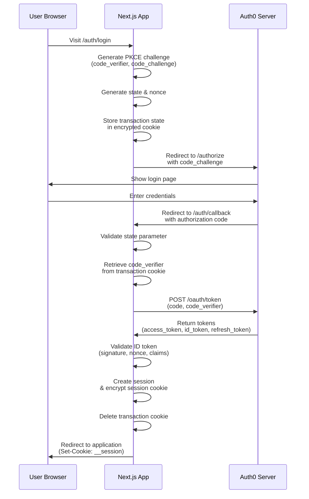
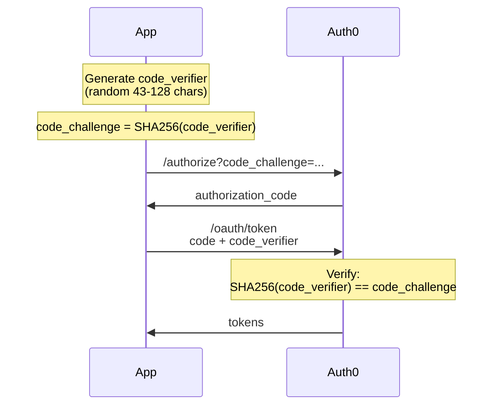

The Auth0 Next.js SDK implements the OAuth 2.0 Authorization Code Flow with PKCE (Proof Key for Code Exchange) to securely authenticate users in your Next.js applications.

## Overview

The SDK handles the complete authentication lifecycle, from initiating login to exchanging authorization codes for tokens and managing user sessions. All authentication routes are automatically handled by the SDK's middleware or proxy layer.

## Authentication Flow Diagram

The following diagram illustrates the complete authentication flow:



## Flow Steps Explained

### 1. Login Initiation (`/auth/login`)

When a user visits `/auth/login`, the SDK:

- Generates PKCE parameters:
  - `code_verifier`: A cryptographically random string
  - `code_challenge`: SHA-256 hash of the code_verifier
- Creates a random `state` parameter to prevent CSRF attacks
- Creates a random `nonce` to prevent token replay attacks
- Stores transaction state in an encrypted cookie
- Redirects the user to Auth0's `/authorize` endpoint

```typescript
// Example authorization URL parameters
const authParams = new URLSearchParams({
  client_id: 'your-client-id',
  redirect_uri: 'https://yourapp.com/auth/callback',
  response_type: 'code',
  scope: 'openid profile email',
  code_challenge: 'E9Melhoa2OwvFrEMTJguCHaoeK1t8URWbuGJSstw-cM',
  code_challenge_method: 'S256',
  state: 'af0ifjsldkj',
  nonce: 'n-0S6_WzA2Mj'
});
```

<Note>
You can pass additional authorization parameters via query strings:
```html
<a href="/auth/login?screen_hint=signup&audience=https://api.example.com">
  Sign up
</a>
```
</Note>

### 2. User Authentication

Auth0 handles the authentication process:

- Displays the login page (Universal Login)
- Validates user credentials
- Performs MFA if required
- Executes any configured Auth0 Actions or Rules

### 3. Authorization Callback (`/auth/callback`)

After successful authentication, Auth0 redirects back to your application with an authorization code. The SDK:

1. **Validates the state parameter** against the stored transaction
2. **Retrieves the code_verifier** from the transaction cookie
3. **Exchanges the authorization code** for tokens:

```typescript
// Token exchange request
POST https://your-domain.auth0.com/oauth/token
Content-Type: application/x-www-form-urlencoded

grant_type=authorization_code&
code=authorization_code_here&
redirect_uri=https://yourapp.com/auth/callback&
code_verifier=dBjftJeZ4CVP-mB92K27uhbUJU1p1r_wW1gFWFOEjXk&
client_id=your-client-id&
client_secret=your-client-secret
```

4. **Receives tokens** from Auth0:
   - `access_token`: Used to call APIs
   - `id_token`: Contains user profile information (JWT)
   - `refresh_token`: Used to obtain new access tokens (optional)
   - `expires_in`: Token expiration time in seconds

5. **Validates the ID token**:
   - Verifies JWT signature using Auth0's public keys (JWKS)
   - Validates the `nonce` claim matches the stored value
   - Checks issuer (`iss`) and audience (`aud`) claims
   - Verifies token hasn't expired (`exp` claim)
   - Validates `max_age` if specified

6. **Creates the session**:
   - Extracts user profile from validated ID token claims
   - Stores tokens and user data in session
   - Encrypts session data and stores in cookie (stateless) or database (stateful)

7. **Cleans up and redirects**:
   - Deletes the transaction cookie
   - Redirects user to the `returnTo` URL or default path

<Warning>
The callback route must be registered in your Auth0 Application's **Allowed Callback URLs** settings in the Auth0 Dashboard.
</Warning>

## PKCE Security

PKCE (Proof Key for Code Exchange) prevents authorization code interception attacks:



Even if an attacker intercepts the authorization code, they cannot exchange it for tokens without the `code_verifier`, which is only stored in your application.

## DPoP Support (Optional)

When DPoP (Demonstrating Proof-of-Possession) is enabled, the SDK binds tokens to cryptographic key pairs:

```typescript
import { Auth0Client } from "@auth0/nextjs-auth0/server";
import { generateKeyPair } from "oauth4webapi";

const dpopKeyPair = await generateKeyPair("ES256");

export const auth0 = new Auth0Client({
  useDPoP: true,
  dpopKeyPair
});
```

With DPoP enabled, the flow includes:

1. **During authorization**: The SDK sends `dpop_jkt` (JWK thumbprint) parameter
2. **During token exchange**: A DPoP proof JWT is sent with each token request
3. **When using tokens**: DPoP proofs are generated for each API request

This prevents token theft since tokens are bound to the application's private key.

<Info>
Learn more about DPoP configuration in the [DPoP Examples](https://github.com/auth0/nextjs-auth0/blob/main/EXAMPLES.md#dpop-demonstrating-proof-of-possession) documentation.
</Info>

## Pushed Authorization Requests (PAR)

When enabled, PAR moves authorization parameters from the URL to a direct backend request:

```typescript
export const auth0 = new Auth0Client({
  pushedAuthorizationRequests: true
});
```

**Standard Flow:**
```
GET /authorize?client_id=...&redirect_uri=...&scope=...&code_challenge=...
```

**PAR Flow:**
```
1. POST /oauth/par (with all parameters in body)
   Response: { request_uri: "urn:ietf:params:oauth:request_uri:abc123" }

2. GET /authorize?client_id=...&request_uri=urn:ietf:params:oauth:request_uri:abc123
```

Benefits:
- Keeps sensitive parameters out of browser history and logs
- Prevents parameter tampering
- Supports larger parameter sets

## Transaction State Management

The SDK stores temporary authentication state in encrypted cookies during the OAuth flow:

```typescript
interface TransactionState {
  nonce: string;                    // ID token validation
  state: string;                    // CSRF protection
  codeVerifier: string;             // PKCE verification
  returnTo?: string;                // Post-login redirect
  scope?: string;                   // Requested scopes
  audience?: string;                // API audience
  maxAge?: number;                  // Max authentication age
  responseType: 'code' | 'connect'; // Flow type
}
```

Transaction cookies are:
- Encrypted using the `AUTH0_SECRET`
- Automatically deleted after callback completes
- Unique per authentication attempt (when `enableParallelTransactions` is true)

<Note>
By default, the SDK supports multiple concurrent authentication flows with unique transaction cookies per flow. Set `enableParallelTransactions: false` to use a single shared transaction cookie.
</Note>

## Error Handling

The SDK provides specific error types for different failure scenarios:

```typescript
import { 
  MissingStateError,
  InvalidStateError,
  AuthorizationError,
  AuthorizationCodeGrantError,
  OAuth2Error
} from '@auth0/nextjs-auth0/errors';
```

**Common errors:**

| Error | Code | Cause | Solution |
|-------|------|-------|----------|
| `MissingStateError` | `missing_state` | State parameter not in callback | Check callback URL format |
| `InvalidStateError` | `invalid_state` | State doesn't match transaction | Transaction expired or CSRF attack |
| `AuthorizationError` | `authorization_error` | Auth0 rejected authorization | Check Auth0 logs for details |
| `AuthorizationCodeGrantError` | `authorization_code_grant_error` | Token exchange failed | Verify client credentials |
| `OAuth2Error` | varies | OAuth 2.0 protocol error | See `error_description` |

## Customizing the Flow

You can customize authentication behavior using hooks and options:

### Before Session Saved Hook

Modify session data before it's persisted:

```typescript
export const auth0 = new Auth0Client({
  async beforeSessionSaved(session, idToken) {
    // Add custom claims to user profile
    session.user.role = session.user['https://myapp.com/role'];
    
    // Remove sensitive claims
    delete session.user['https://myapp.com/internal'];
    
    return session;
  }
});
```

### On Callback Hook

Customize redirect behavior or handle errors:

```typescript
export const auth0 = new Auth0Client({
  async onCallback(error, context, session) {
    if (error) {
      console.error('Auth error:', error);
      return NextResponse.redirect('/login?error=auth_failed');
    }
    
    // Custom redirect based on user role
    if (session?.user.role === 'admin') {
      return NextResponse.redirect('/admin/dashboard');
    }
    
    return NextResponse.redirect(context.returnTo || '/');
  }
});
```

## Next Steps

- Learn about [Session Management](/concepts/session-management) after authentication
- Explore all [Authentication Routes](/concepts/routes) provided by the SDK
- Configure [Authorization Parameters](https://github.com/auth0/nextjs-auth0/blob/main/EXAMPLES.md#passing-authorization-parameters)
