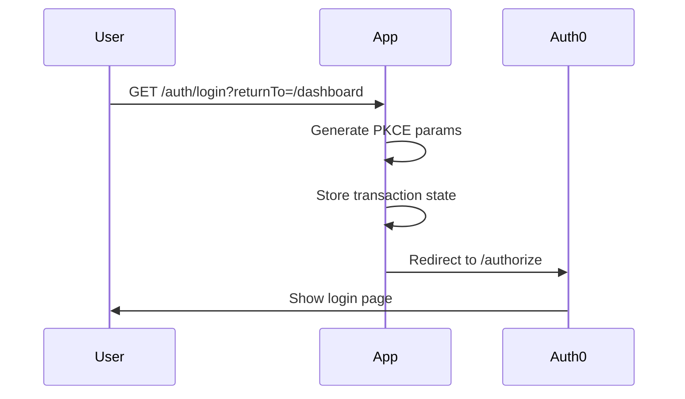
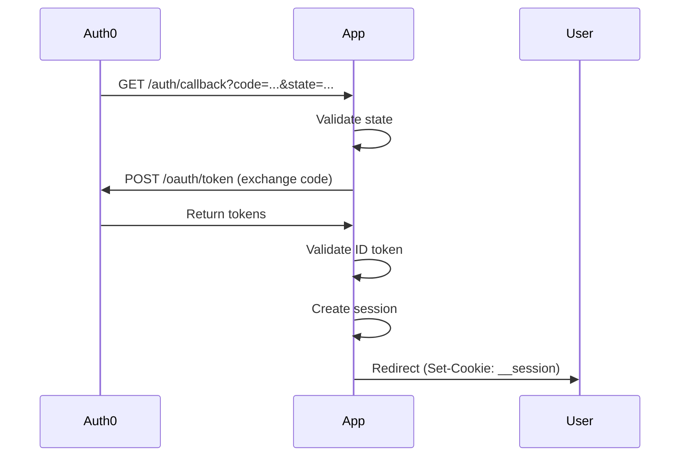
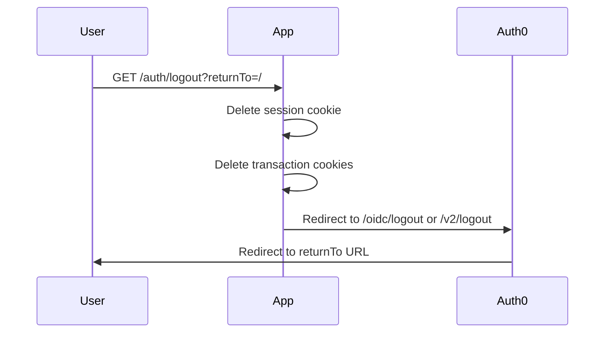
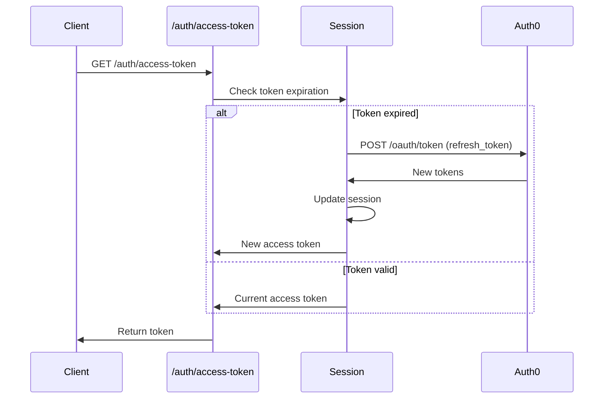
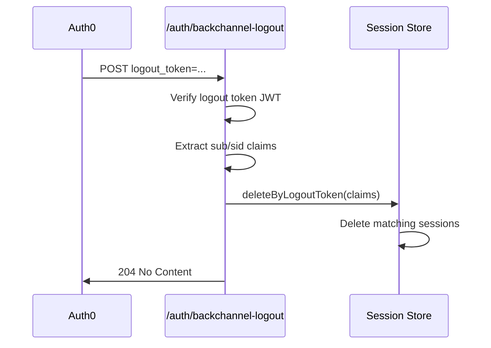
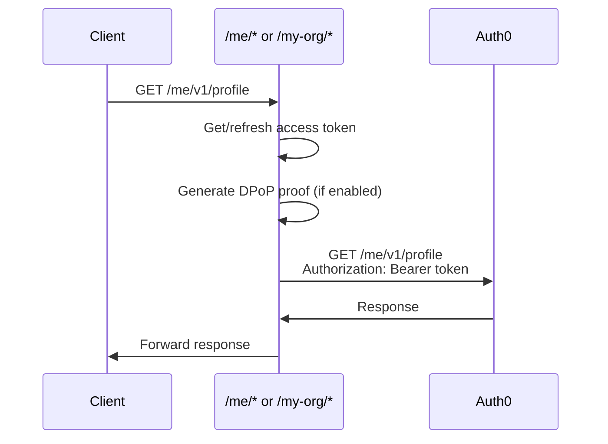

The Auth0 Next.js SDK automatically mounts 6 authentication routes that handle the complete authentication lifecycle. These routes are processed by the SDK's middleware (Next.js 15) or proxy (Next.js 16).

## Route Overview

All routes are mounted under the `/auth` prefix by default:

| Route | Method | Purpose |
|-------|--------|--------|
| `/auth/login` | GET | Initiate authentication flow |
| `/auth/callback` | GET | Handle OAuth callback |
| `/auth/logout` | GET | End user session |
| `/auth/profile` | GET | Get user profile |
| `/auth/access-token` | GET | Get access token |
| `/auth/backchannel-logout` | POST | Handle back-channel logout |

## Route Details

### `/auth/login`

Initiates the authentication flow by redirecting users to Auth0's login page.

**Usage:**

```html
<!-- Basic login -->
<a href="/auth/login">Log in</a>

<!-- Show signup screen -->
<a href="/auth/login?screen_hint=signup">Sign up</a>

<!-- Redirect after login -->
<a href="/auth/login?returnTo=/dashboard">Go to Dashboard</a>

<!-- Pass authorization parameters -->
<a href="/auth/login?audience=https://api.example.com&scope=read:data">Login</a>
```

**Query Parameters:**

| Parameter | Description | Example |
|-----------|-------------|--------|
| `returnTo` | Where to redirect after login | `/dashboard` |
| `screen_hint` | Show login or signup | `signup` |
| `audience` | API identifier | `https://api.example.com` |
| `scope` | OAuth scopes | `read:data write:data` |
| `connection` | Specific connection | `google-oauth2` |
| `prompt` | Auth0 prompt behavior | `login`, `none` |
| `organization` | Organization ID | `org_abc123` |
| `invitation` | Organization invitation | `inv_abc123` |

**Flow diagram:**



<Warning>
The `returnTo` URL must be registered in your Auth0 Application's **Allowed Callback URLs**. The SDK validates the URL against this list for security.
</Warning>

### `/auth/callback`

Handles the OAuth callback after successful authentication.

**Flow:**

1. Validates the `state` parameter against stored transaction
2. Exchanges authorization code for tokens
3. Validates ID token (signature, nonce, expiration)
4. Creates encrypted session
5. Redirects to `returnTo` or default path



**Error handling:**

If authentication fails, the SDK calls the `onCallback` hook (if configured) or returns a 500 error:

```typescript
export const auth0 = new Auth0Client({
  async onCallback(error, context, session) {
    if (error) {
      console.error('Authentication failed:', error);
      return NextResponse.redirect('/login?error=auth_failed');
    }
    
    // Success - redirect to returnTo or default
    return NextResponse.redirect(context.returnTo || '/');
  }
});
```

<Warning>
This route must be registered in your Auth0 Application's **Allowed Callback URLs**. The default URL is `http://localhost:3000/auth/callback` for development.
</Warning>

### `/auth/logout`

Ends the user's session and redirects to Auth0's logout endpoint.

**Usage:**

```html
<!-- Basic logout -->
<a href="/auth/logout">Log out</a>

<!-- Redirect after logout -->
<a href="/auth/logout?returnTo=https://example.com/goodbye">Log out</a>

<!-- Federated logout (also logs out of identity provider) -->
<a href="/auth/logout?federated">Log out everywhere</a>
```

**Query Parameters:**

| Parameter | Description | Example |
|-----------|-------------|--------|
| `returnTo` | Where to redirect after logout | `https://example.com` |
| `federated` | Also logout from IdP | Flag (no value needed) |

**Logout strategies:**

The SDK supports three logout strategies:

```typescript
export const auth0 = new Auth0Client({
  logoutStrategy: 'auto' // 'auto' | 'oidc' | 'v2'
});
```

| Strategy | Behavior |
|----------|----------|
| `auto` (default) | Uses OIDC logout if available, falls back to `/v2/logout` |
| `oidc` | Always uses OIDC RP-Initiated Logout (returns error if not available) |
| `v2` | Always uses Auth0's `/v2/logout` endpoint (supports wildcards) |

**Logout flow:**



<Warning>
The `returnTo` URL must be registered in your Auth0 Application's **Allowed Logout URLs**.
</Warning>

<Info>
For OIDC logout, the SDK can optionally exclude `id_token_hint` for privacy:
```typescript
export const auth0 = new Auth0Client({
  includeIdTokenHintInOIDCLogoutUrl: false // Excludes PII from logout URL
});
```
See [OIDC Logout Privacy Configuration](https://github.com/auth0/nextjs-auth0/blob/main/EXAMPLES.md#oidc-logout-privacy-configuration) for details.
</Info>

### `/auth/profile`

Returns the current user's profile from the session.

**Response when authenticated:**

```json
{
  "sub": "auth0|507f1f77bcf86cd799439011",
  "name": "John Doe",
  "email": "john@example.com",
  "picture": "https://example.com/photo.jpg",
  "updated_at": "2024-01-01T00:00:00.000Z"
}
```

**Response when not authenticated:**

- Default: `401 Unauthorized` with empty body
- With `noContentProfileResponseWhenUnauthenticated: true`: `204 No Content`

```typescript
export const auth0 = new Auth0Client({
  noContentProfileResponseWhenUnauthenticated: true
});
```

**Client-side usage:**

The `useUser()` hook fetches from this route:

```typescript
'use client';

import { useUser } from '@auth0/nextjs-auth0';

export default function Profile() {
  const { user, isLoading, error } = useUser();
  
  if (isLoading) return <div>Loading...</div>;
  if (error) return <div>Error loading profile</div>;
  if (!user) return <div>Not logged in</div>;
  
  return (
    <div>
      
      <h1>{user.name}</h1>
      <p>{user.email}</p>
    </div>
  );
}
```

<Note>
The profile route returns user data from the ID token claims stored in the session. It does **not** make additional API calls to Auth0. To get fresh user data, use the Management API or re-authenticate the user.
</Note>

### `/auth/access-token`

Returns an access token for calling external APIs. Automatically refreshes expired tokens if a refresh token is available.

**Response:**

```json
{
  "token": "eyJhbGciOiJSUzI1NiIsInR5cCI6IkpXVCJ9...",
  "expires_at": 1704585600,
  "expires_in": 86400,
  "scope": "openid profile email read:data",
  "token_type": "Bearer"
}
```

**Query Parameters:**

| Parameter | Description | Example |
|-----------|-------------|--------|
| `audience` | API audience | `https://api.example.com` |
| `scope` | Additional scopes | `read:data write:data` |

**Client-side usage:**

```typescript
import { getAccessToken } from '@auth0/nextjs-auth0';

async function callAPI() {
  try {
    const token = await getAccessToken();
    
    const response = await fetch('https://api.example.com/data', {
      headers: {
        Authorization: `Bearer ${token}`
      }
    });
    
    return await response.json();
  } catch (error) {
    console.error('Failed to get access token:', error);
  }
}

// Or get full response
const tokenSet = await getAccessToken({ includeFullResponse: true });
console.log(`Token expires in ${tokenSet.expires_in} seconds`);
```

**Automatic token refresh:**



**Configuration:**

```typescript
export const auth0 = new Auth0Client({
  // Disable the endpoint if not needed
  enableAccessTokenEndpoint: false,
  
  // Refresh tokens slightly before expiration
  tokenRefreshBuffer: 60 // seconds
});
```

<Warning>
This route is enabled by default but should only be used when access tokens are needed client-side. For server-side API calls, use `auth0.getAccessToken()` directly to avoid unnecessary network requests.
</Warning>

### `/auth/backchannel-logout`

Handles back-channel logout requests from Auth0. This allows Auth0 to notify your application when a user's session should be terminated.

**Requirements:**

1. Stateful session storage (database-backed)
2. Session store must implement `deleteByLogoutToken()` method
3. Route must be configured in Auth0 Dashboard

**Implementation:**

```typescript
import { SessionDataStore, LogoutToken } from '@auth0/nextjs-auth0/types';

class MySessionStore implements SessionDataStore {
  async get(id: string): Promise<SessionData | null> {
    // ...
  }
  
  async set(id: string, session: SessionData): Promise<void> {
    // ...
  }
  
  async delete(id: string): Promise<void> {
    // ...
  }
  
  // Required for back-channel logout
  async deleteByLogoutToken(claims: LogoutToken): Promise<void> {
    // Find and delete sessions matching the logout token
    if (claims.sub) {
      await this.deleteSessionsByUserId(claims.sub);
    }
    
    if (claims.sid) {
      await this.deleteSessionById(claims.sid);
    }
  }
}
```

**Flow:**



<Info>
Back-channel logout is only available with stateful sessions. Cookie-based (stateless) sessions cannot be revoked server-side. To learn more, see [Back-Channel Logout](https://github.com/auth0/nextjs-auth0/blob/main/EXAMPLES.md#back-channel-logout) documentation.
</Info>

## Custom Route Configuration

You can customize the route paths:

```typescript
import { Auth0Client } from '@auth0/nextjs-auth0/server';

export const auth0 = new Auth0Client({
  routes: {
    login: '/api/auth/login',
    logout: '/api/auth/logout',
    callback: '/api/auth/callback',
    backChannelLogout: '/api/auth/backchannel-logout',
    connectAccount: '/api/auth/connect-account'
  }
});
```

<Warning>
If you customize routes, you **must** update the **Allowed Callback URLs** and **Allowed Logout URLs** in your Auth0 Application settings to match the new paths.
</Warning>

## Proxy Routes (My Account & My Organization APIs)

The SDK provides two additional proxy routes for Auth0's My Account and My Organization Management APIs:

### `/me/*` - My Account API Proxy

Proxies requests to Auth0's My Account API (`https://{domain}/me/v1/*`):

```typescript
// Client-side usage
const response = await fetch('/me/v1/profile', {
  headers: {
    'scope': 'profile:read'
  }
});

const profile = await response.json();
```

### `/my-org/*` - My Organization API Proxy

Proxies requests to Auth0's My Organization API (`https://{domain}/my-org/*`):

```typescript
// Client-side usage
const response = await fetch('/my-org/organizations', {
  headers: {
    'scope': 'org:read'
  }
});

const orgs = await response.json();
```

**How it works:**



Benefits:
- Tokens remain on the server
- Automatic token refresh
- DPoP support for enhanced security
- No CORS issues

<Info>
Learn more about [Proxy Handler for My Account and My Organization APIs](https://github.com/auth0/nextjs-auth0/blob/main/EXAMPLES.md#proxy-handler-for-my-account-and-my-organization-apis).
</Info>

## Route Protection

By default, authentication routes are public. To protect your application routes:

### Middleware Approach

```typescript
// middleware.ts
import { NextRequest, NextResponse } from 'next/server';
import { auth0 } from './lib/auth0';

export async function middleware(request: NextRequest) {
  const authRes = await auth0.middleware(request);
  
  // Handle auth routes
  if (request.nextUrl.pathname.startsWith('/auth')) {
    return authRes;
  }
  
  // Protect dashboard routes
  if (request.nextUrl.pathname.startsWith('/dashboard')) {
    const session = await auth0.getSession(request);
    
    if (!session) {
      return NextResponse.redirect(
        new URL('/auth/login?returnTo=/dashboard', request.url)
      );
    }
  }
  
  return authRes;
}

export const config = {
  matcher: ['/((?!_next/static|_next/image|favicon.ico).*)']
};
```

### Helper Methods

**Server Components:**

```typescript
import { auth0 } from '@/lib/auth0';

export default auth0.withPageAuthRequired(async function Dashboard() {
  const { user } = await auth0.getSession();
  return <div>Welcome {user.name}</div>;
}, { returnTo: '/dashboard' });
```

**Client Components:**

```typescript
'use client';

import { withPageAuthRequired } from '@auth0/nextjs-auth0';

function Dashboard({ user }) {
  return <div>Welcome {user.name}</div>;
}

export default withPageAuthRequired(Dashboard);
```

**API Routes:**

```typescript
import { auth0 } from '@/lib/auth0';

export const GET = auth0.withApiAuthRequired(async function handler() {
  const { user } = await auth0.getSession();
  return Response.json({ user });
});
```

## Base Path Support

If your Next.js app uses a base path, set the `NEXT_PUBLIC_BASE_PATH` environment variable:

```bash
NEXT_PUBLIC_BASE_PATH=/dashboard
```

The SDK will mount routes at `/dashboard/auth/login`, `/dashboard/auth/callback`, etc.

<Note>
Do not use `APP_BASE_URL` with a path component when using `NEXT_PUBLIC_BASE_PATH`. Set `APP_BASE_URL` to the root domain only.
</Note>

## Route Security Considerations

1. **Always use HTTPS in production** - Authentication routes transmit sensitive data
2. **Validate redirect URLs** - The SDK validates `returnTo` against allowed URLs
3. **Register callback URLs** - Add all callback URLs to Auth0 Dashboard
4. **Use SameSite cookies** - Prevents CSRF attacks (enabled by default)
5. **Implement CSRF protection** - The SDK uses `state` parameter for CSRF protection
6. **Monitor authentication errors** - Log errors from `onCallback` hook
7. **Rate limit auth routes** - Protect against brute force attacks

## Next Steps

- Understand the [Authentication Flow](/concepts/authentication-flow) that powers these routes
- Configure [Session Management](/concepts/session-management) for your needs
- Explore [Custom Route Configuration](https://github.com/auth0/nextjs-auth0/blob/main/EXAMPLES.md#custom-routes)
