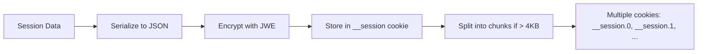
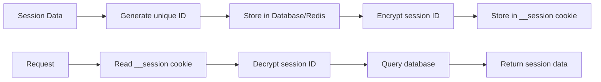
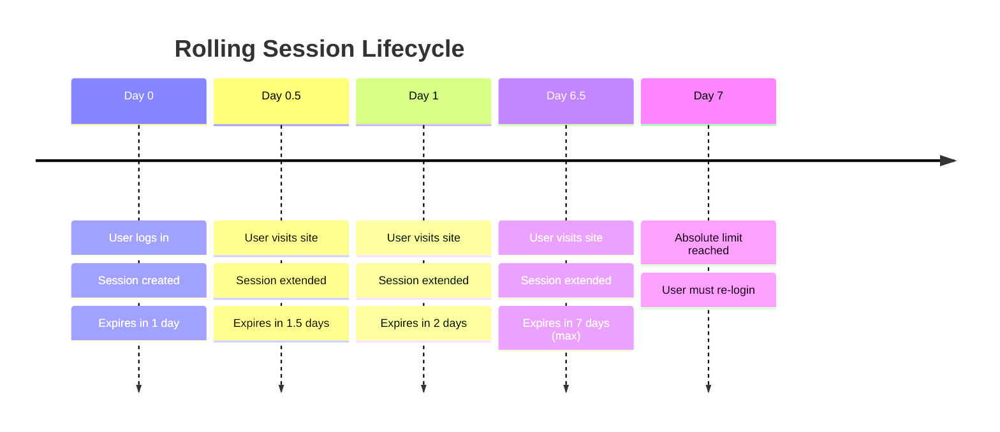
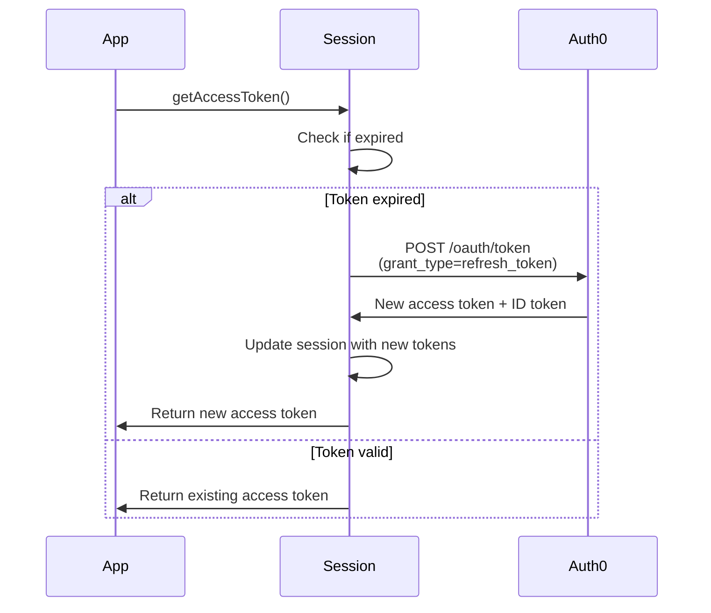
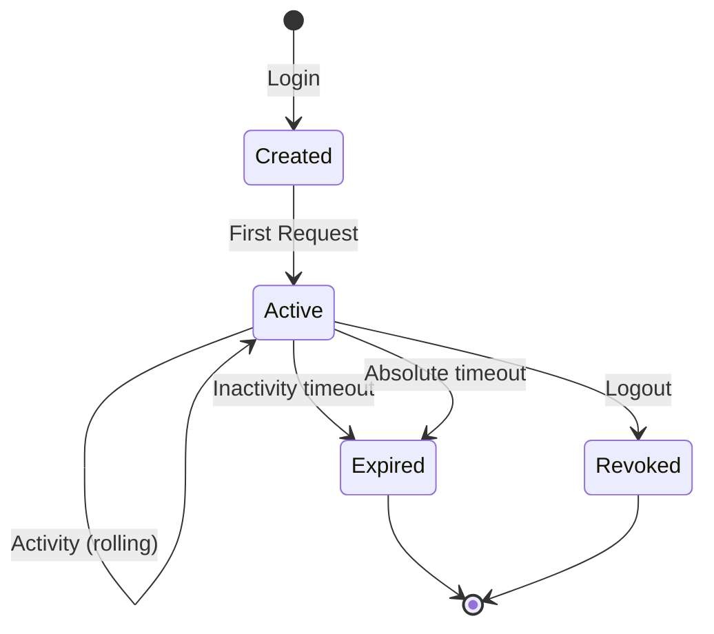

After successful authentication, the Auth0 Next.js SDK creates and manages a user session. The SDK supports two session storage strategies: **stateless** (cookie-based) and **stateful** (database-backed).

## Session Data Structure

The session contains all authentication state for the current user:

```typescript
interface SessionData {
  user: User;                      // User profile from ID token
  tokenSet: TokenSet;              // OAuth tokens
  internal: {                      // SDK metadata
    sid: string;                   // Session ID from ID token
    createdAt: number;             // Unix timestamp
  };
  accessTokens?: AccessTokenSet[]; // MRRT tokens (optional)
  connectionTokenSets?: ConnectionTokenSet[]; // Federated tokens (optional)
  mfaContext?: MfaContext;         // MFA state (optional)
}

interface TokenSet {
  accessToken: string;             // API access token
  idToken: string;                 // User identity token (JWT)
  refreshToken?: string;           // Token for refresh
  expiresAt?: number;              // Unix timestamp
  scope?: string;                  // Granted scopes
  audience?: string;               // API audience
  requestedScope?: string;         // Originally requested scopes
  token_type?: string;             // Usually "Bearer"
}

interface User {
  sub: string;                     // Unique user ID
  name?: string;                   // Full name
  email?: string;                  // Email address
  picture?: string;                // Profile picture URL
  [key: string]: any;              // Custom claims
}
```

## Storage Strategies

### Stateless Sessions (Default)

Session data is encrypted and stored entirely in cookies. This is the default mode and requires no external dependencies.

**Advantages:**
- Zero external dependencies
- Simple deployment
- Automatic scaling (no shared state)
- Fast session retrieval

**Limitations:**
- Cookie size limits (~4KB per cookie)
- Cannot revoke sessions server-side
- All session data travels with every request

**Configuration:**

```typescript
import { Auth0Client } from "@auth0/nextjs-auth0/server";

export const auth0 = new Auth0Client({
  // Stateless is the default - no sessionStore needed
  session: {
    rolling: true,
    absoluteDuration: 60 * 60 * 24 * 7, // 7 days
    inactivityDuration: 60 * 60 * 24,   // 1 day
    cookie: {
      name: '__session',
      sameSite: 'lax',
      secure: true,
      path: '/'
    }
  }
});
```

**Storage mechanism:**



The SDK automatically chunks large sessions across multiple cookies if needed.

<Warning>
If your session exceeds browser cookie limits (~20 cookies or ~4KB per cookie), consider using stateful sessions or reducing session size by removing unnecessary custom claims.
</Warning>

### Stateful Sessions

Session data is stored in an external database, with only a session ID stored in the cookie.

**Advantages:**
- No cookie size limitations
- Server-side session revocation
- Reduced bandwidth (small cookie)
- Centralized session management

**Disadvantages:**
- Requires external data store
- Additional latency for database queries
- More complex infrastructure

**Configuration:**

```typescript
import { Auth0Client } from "@auth0/nextjs-auth0/server";
import { SessionDataStore } from "@auth0/nextjs-auth0/types";

// Implement the SessionDataStore interface
class RedisSessionStore implements SessionDataStore {
  async get(id: string): Promise<SessionData | null> {
    const data = await redis.get(`session:${id}`);
    return data ? JSON.parse(data) : null;
  }

  async set(id: string, session: SessionData): Promise<void> {
    await redis.set(
      `session:${id}`,
      JSON.stringify(session),
      'EX',
      60 * 60 * 24 * 7 // 7 days TTL
    );
  }

  async delete(id: string): Promise<void> {
    await redis.del(`session:${id}`);
  }

  // Optional: Required for back-channel logout
  async deleteByLogoutToken(claims: LogoutToken): Promise<void> {
    // Find and delete sessions matching the logout token
    const sessionIds = await redis.keys('session:*');
    for (const key of sessionIds) {
      const session = await this.get(key.replace('session:', ''));
      if (session?.user.sub === claims.sub) {
        await redis.del(key);
      }
    }
  }
}

export const auth0 = new Auth0Client({
  sessionStore: new RedisSessionStore()
});
```

**Storage mechanism:**



<Info>
For database session examples, see [Database Sessions](https://github.com/auth0/nextjs-auth0/blob/main/EXAMPLES.md#database-sessions) in the documentation.
</Info>

## Rolling Sessions

Rolling sessions extend the session lifetime with each request, up to an absolute maximum.

```typescript
export const auth0 = new Auth0Client({
  session: {
    rolling: true,                      // Enable rolling sessions
    absoluteDuration: 60 * 60 * 24 * 7, // Max 7 days from creation
    inactivityDuration: 60 * 60 * 24    // Expires after 1 day of inactivity
  }
});
```

**How it works:**



With rolling sessions:
- **Active users** remain authenticated as long as they use the app within the inactivity window
- **Inactive users** are automatically logged out after the inactivity duration
- **Maximum lifetime** prevents indefinite sessions

**Without rolling sessions** (`rolling: false`):
- Session expires after `absoluteDuration` regardless of activity
- Users must re-login after the fixed duration
- More predictable but less user-friendly

<Note>
The SDK's middleware automatically touches sessions on every request when rolling sessions are enabled, extending the session lifetime. This is why the middleware matcher should include all protected routes.
</Note>

## Session Cookie Configuration

### Cookie Attributes

```typescript
export const auth0 = new Auth0Client({
  session: {
    cookie: {
      name: '__session',           // Cookie name
      sameSite: 'lax',            // CSRF protection
      secure: true,               // HTTPS only (recommended)
      path: '/',                  // Cookie path
      domain: undefined,          // Cookie domain (optional)
      transient: false            // Session vs persistent cookie
    }
  }
});
```

**Or via environment variables:**

```bash
AUTH0_COOKIE_DOMAIN=example.com
AUTH0_COOKIE_PATH=/
AUTH0_COOKIE_TRANSIENT=false
AUTH0_COOKIE_SECURE=true
AUTH0_COOKIE_SAME_SITE=lax
```

### Cookie Attributes Explained

| Attribute | Values | Purpose |
|-----------|--------|--------|
| `sameSite` | `strict`, `lax`, `none` | CSRF protection level |
| `secure` | `true`, `false` | Require HTTPS |
| `httpOnly` | Always `true` | Prevent JavaScript access |
| `path` | Any path | Cookie scope |
| `domain` | Domain string | Share across subdomains |
| `transient` | `true`, `false` | Session vs persistent cookie |

<Warning>
**Security Best Practices:**
- Always use `secure: true` in production (HTTPS)
- Keep `httpOnly: true` (hardcoded by SDK) to prevent XSS attacks
- Use `sameSite: 'lax'` or `'strict'` for CSRF protection
- Only set `sameSite: 'none'` if you need cross-site cookies (requires `secure: true`)
</Warning>

## Accessing Sessions

### Server Components (App Router)

```typescript
import { auth0 } from '@/lib/auth0';

export default async function Page() {
  const session = await auth0.getSession();
  
  if (!session) {
    return <div>Not authenticated</div>;
  }
  
  return <div>Hello {session.user.name}</div>;
}
```

### API Routes (App Router)

```typescript
import { auth0 } from '@/lib/auth0';
import { NextResponse } from 'next/server';

export async function GET() {
  const session = await auth0.getSession();
  
  if (!session) {
    return NextResponse.json({ error: 'Unauthorized' }, { status: 401 });
  }
  
  return NextResponse.json({ user: session.user });
}
```

### Pages Router

```typescript
import { auth0 } from '@/lib/auth0';
import type { GetServerSideProps } from 'next';

export const getServerSideProps: GetServerSideProps = async ({ req }) => {
  const session = await auth0.getSession(req);
  
  if (!session) {
    return { props: { user: null } };
  }
  
  return { props: { user: session.user } };
};
```

### Client Components

```typescript
'use client';

import { useUser } from '@auth0/nextjs-auth0';

export default function Profile() {
  const { user, isLoading, error } = useUser();
  
  if (isLoading) return <div>Loading...</div>;
  if (error) return <div>Error: {error.message}</div>;
  if (!user) return <div>Not authenticated</div>;
  
  return <div>Hello {user.name}</div>;
}
```

<Info>
The `useUser()` hook fetches user data from the `/auth/profile` route, which reads from the server-side session.
</Info>

## Updating Sessions

You can modify session data after authentication:

```typescript
import { auth0 } from '@/lib/auth0';
import { NextResponse } from 'next/server';

export async function POST() {
  const session = await auth0.getSession();
  
  if (!session) {
    return NextResponse.json({ error: 'Unauthorized' }, { status: 401 });
  }
  
  // Update session with custom data
  await auth0.updateSession({
    ...session,
    user: {
      ...session.user,
      lastVisit: new Date().toISOString()
    }
  });
  
  return NextResponse.json({ success: true });
}
```

<Note>
Session updates are overwritten when the user re-authenticates or when tokens are refreshed. For persistent user metadata, store it in your database or use Auth0's user metadata feature.
</Note>

## Token Refresh

When a refresh token is available, the SDK automatically refreshes expired access tokens:

```typescript
// Automatic refresh when token is expired
const accessToken = await auth0.getAccessToken();

// Force refresh even if not expired
const accessToken = await auth0.getAccessToken({ refresh: true });
```

**Refresh flow:**



<Warning>
**Refresh Token Rotation:** If your Auth0 application uses Refresh Token Rotation, configure an overlap period in your Auth0 Dashboard to prevent race conditions when multiple requests attempt to refresh tokens simultaneously.
</Warning>

## Session Security

### Encryption

All session data is encrypted using **JWE (JSON Web Encryption)** with the `AUTH0_SECRET`:

```bash
# Generate a secure secret (32+ bytes)
openssl rand -hex 32
```

### Session Lifecycle



### Best Practices

1. **Use strong secrets**: Generate with `openssl rand -hex 32`
2. **Enable HTTPS**: Set `secure: true` in production
3. **Configure SameSite**: Use `'lax'` or `'strict'` for CSRF protection
4. **Set reasonable durations**: Balance security and user experience
5. **Monitor session size**: Keep under 4KB for cookie-based sessions
6. **Implement logout**: Clear sessions when users log out
7. **Use refresh tokens**: Enable offline_access scope for long-lived sessions
8. **Handle token expiration**: Refresh tokens before they expire

## Multi-Resource Refresh Tokens (MRRT)

When calling multiple APIs, the SDK stores separate access tokens per audience:

```typescript
// Default audience token
const defaultToken = await auth0.getAccessToken();

// Different audience token
const apiToken = await auth0.getAccessToken({
  audience: 'https://api.example.com'
});
```

The session structure with MRRT:

```typescript
{
  tokenSet: {
    accessToken: 'token-for-default-audience',
    refreshToken: 'refresh-token',
    // ...
  },
  accessTokens: [
    {
      accessToken: 'token-for-api1',
      audience: 'https://api1.example.com',
      scope: 'read:data',
      expiresAt: 1234567890
    },
    {
      accessToken: 'token-for-api2',
      audience: 'https://api2.example.com',
      scope: 'read:data write:data',
      expiresAt: 1234567890
    }
  ]
}
```

<Info>
Learn more about [Multi-Resource Refresh Tokens](https://github.com/auth0/nextjs-auth0/blob/main/EXAMPLES.md#multi-resource-refresh-tokens-mrrt) in the documentation.
</Info>

## Session Debugging

To inspect session contents during development:

```typescript
import { auth0 } from '@/lib/auth0';

export async function GET() {
  const session = await auth0.getSession();
  
  console.log('Session data:', {
    user: session?.user,
    tokenSet: {
      hasAccessToken: !!session?.tokenSet.accessToken,
      hasRefreshToken: !!session?.tokenSet.refreshToken,
      expiresAt: session?.tokenSet.expiresAt,
      scope: session?.tokenSet.scope
    },
    createdAt: session?.internal.createdAt,
    age: session ? Date.now() / 1000 - session.internal.createdAt : 0
  });
  
  return Response.json({ ok: true });
}
```

## Next Steps

- Explore [Authentication Routes](/concepts/routes) that interact with sessions
- Learn about [Authentication Flow](/concepts/authentication-flow) that creates sessions
- Configure [Session Settings](https://github.com/auth0/nextjs-auth0/blob/main/EXAMPLES.md#session-configuration) for your needs
