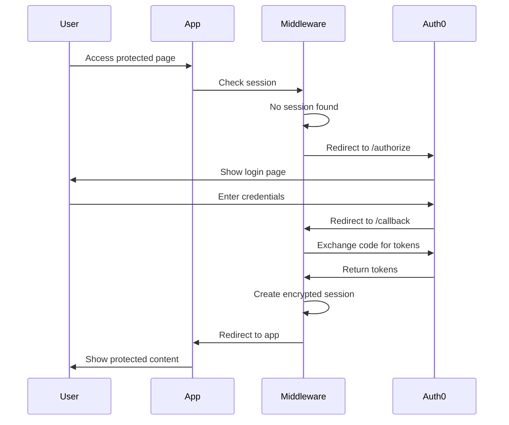

<div className="relative overflow-hidden rounded-xl border border-[rgba(96,99,146,1)] bg-[rgba(48,54,79,1)] p-8 mb-8">
  <h1 className="text-5xl font-bold text-white mb-4">Auth0 Next.js SDK</h1>
  <p className="text-xl text-white/90 mb-6">
    A powerful SDK for implementing user authentication in Next.js applications with Auth0
  </p>
  <div className="flex gap-4">
    <a 
      href="/quickstart" 
      className="inline-block px-6 py-3 bg-[#238636] text-white font-semibold rounded-md hover:bg-[#2ea043] transition-colors"
    >
      Get Started
    </a>
    <a 
      href="https://github.com/auth0/nextjs-auth0" 
      className="inline-block px-6 py-3 bg-transparent text-white font-semibold rounded-md border border-white/30 hover:bg-white/10 transition-colors"
    >
      View on GitHub
    </a>
  </div>
</div>

## What is Auth0 Next.js SDK?

The Auth0 Next.js SDK is a library for implementing user authentication in Next.js applications. It provides both client-side and server-side APIs to integrate Auth0 authentication seamlessly into your Next.js app, supporting both the App Router and Pages Router.

<CardGroup cols={2}>
  <Card title="Quick to Integrate" icon="rocket">
    Get authentication up and running in minutes with minimal configuration
  </Card>
  <Card title="Secure by Default" icon="shield-check">
    Built-in security best practices including encrypted session cookies and CSRF protection
  </Card>
  <Card title="Full TypeScript Support" icon="code">
    Complete type definitions for all APIs and configuration options
  </Card>
  <Card title="Flexible Session Management" icon="database">
    Choose between stateless cookie-based sessions or stateful external storage
  </Card>
</CardGroup>

## Key Features

<AccordionGroup>
  <Accordion title="Universal Next.js Support">
    Works seamlessly with both Next.js App Router and Pages Router, supporting Next.js 14, 15, and 16.
  </Accordion>
  
  <Accordion title="Client & Server APIs">
    React hooks like `useUser()` for client-side usage and `Auth0Client` for server-side operations.
  </Accordion>
  
  <Accordion title="Advanced Security">
    Supports DPoP (Demonstrating Proof-of-Possession) for token binding and Multi-Factor Authentication (MFA).
  </Accordion>
  
  <Accordion title="Multi-Resource Refresh Tokens">
    Manage multiple access tokens for different APIs with automatic token refresh per audience.
  </Accordion>
  
  <Accordion title="Session Management">
    Flexible session configuration with support for rolling sessions, custom session stores, and session hooks.
  </Accordion>
  
  <Accordion title="Proxy Handlers">
    Built-in proxy support for Auth0's My Account and My Organization Management APIs.
  </Accordion>
</AccordionGroup>

## How It Works

The SDK intercepts authentication requests at the network boundary using Next.js middleware (or proxy in Next.js 16) and handles the complete OAuth 2.0 / OIDC flow:



## Package Structure

The SDK is organized into multiple entry points for different use cases:

<Tabs>
  <Tab title="Client">
    ```typescript
    import { useUser, getAccessToken, Auth0Provider } from '@auth0/nextjs-auth0';
    ```
    
    Client-side React hooks and components for use in browser environments.
  </Tab>
  
  <Tab title="Server">
    ```typescript
    import { Auth0Client } from '@auth0/nextjs-auth0/server';
    ```
    
    Server-side authentication client for use in API routes, server components, and middleware.
  </Tab>
  
  <Tab title="Errors">
    ```typescript
    import { SdkError, AccessTokenError } from '@auth0/nextjs-auth0/errors';
    ```
    
    Error classes for handling authentication failures and OAuth errors.
  </Tab>
  
  <Tab title="Types">
    ```typescript
    import type { SessionData, User, TokenSet } from '@auth0/nextjs-auth0/types';
    ```
    
    TypeScript type definitions for sessions, users, and tokens.
  </Tab>
</Tabs>

## Next Steps

<CardGroup cols={2}>
  <Card title="Installation" icon="download" href="/installation">
    Install the SDK and configure your environment variables
  </Card>
  <Card title="Quickstart" icon="bolt" href="/quickstart">
    Get a working authentication flow in under 5 minutes
  </Card>
  <Card title="Core Concepts" icon="book" href="/concepts/authentication-flow">
    Learn how authentication flows work in the SDK
  </Card>
  <Card title="API Reference" icon="code" href="/api/server/auth0-client">
    Explore the complete API documentation
  </Card>
</CardGroup>

## Requirements

- **Node.js**: Version 20 LTS or newer
- **Next.js**: Version 14.2.35 or newer (supports 14.x, 15.x, and 16.x)
- **React**: Version 18.0.0 or newer (supports 18.x and 19.x)
- **Auth0 Account**: A free Auth0 account with a Regular Web Application configured

## Community & Support

<CardGroup cols={3}>
  <Card title="GitHub Issues" icon="github" href="https://github.com/auth0/nextjs-auth0/issues">
    Report bugs and request features
  </Card>
  <Card title="Auth0 Community" icon="users" href="https://community.auth0.com">
    Get help from the Auth0 community
  </Card>
  <Card title="Security" icon="shield" href="/resources/security">
    Report security vulnerabilities
  </Card>
</CardGroup>
